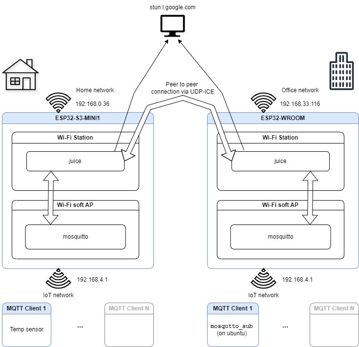

# Brokerless MQTT Example

MQTT served by (two) mosquitto's running on two ESP chips.

* Leverages MQTT connectivity between two private networks without cloud premisses.
* Creates two local MQTT servers (on ESP32x's) which are being synchronized over peer to peer connection (established via ICE protocol, by [libjuice](https://github.com/paullouisageneau/libjuice)).

## How it works

This example needs two ESP32 chipsets, that will create two separate Wi-Fi networks (IoT networks) used for IoT devices.
Each IoT network is served by an MQTT server (using mosquitto component).
This example will also synchronize these two MQTT brokers, as if there was only one IoT network with one broker.
This example creates a peer to peer connection between two chipsets to keep them synchronize. This connection utilizes libjuice (which implements a simplified ICE-UDP) to traverse NATs, which enabling direct connection between two private networks behind NATs.

* Diagram



Here's a step-by-step procedure of establishing this remote connection:
1) Initialize and start Wi-Fi AP (for IoT networks) and Wi-Fi station (for internet connection)
2) Start mosquitto broker on IoT network
3) Start libjuice to gather connection candidates
4) Synchronize using a public MQTT broker and exchange ICE descriptors
5) Establish ICE UDP connection between the two ESP32 chipsets
6) Start forwarding mqtt messages
   - Each remote datagram (received from ICE-UDP channel) is re-published to the local MQTT server
   - Each local MQTT message (received from mosquitto on_message callback) is sent in ICE-UDP datagram

## How to use this example

You need two ESP32 devices that support Wi-Fi station and Wi-Fi software access point.

* Configure Wi-Fi credentials for both devices on both interfaces
  * These devices would be deployed in distinct Wi-Fi environments, so the Wi-Fi station credentials would likely be different.
  * They also create their own IoT network (on the soft-AP interface) Wi-Fi, so the AP credentials would likely be the same, suggesting the IoT networks will be keep synchronized (even though these are two distict Wi-Fi networks).
* Choose `CONFIG_EXAMPLE_SERVERLESS_ROLE_PEER1` for one device and `CONFIG_EXAMPLE_SERVERLESS_ROLE_PEER2` for another. It's not important which device is PEER1, since the code is symmetric, but these two devices need to have different role.
* Optionally: You can use `idf.py` `-D` and `-B` flag to keep separate build directories and sdkconfigs for these two roles
```
idf.py -B build1 -DSDKCONFIG=build1/sdkconfig menuconfig build flash monitor
```
* Flash and run the two devices and wait for them to connect and synchronize.
* Now you can test MQTT connectivity, for example:
  * Join PEER1 device's AP and connect to the MQTT broker with one or more clients, subscribing to one or more topics.
  * Join PEER2 device's AP and connect to the MQTT broker with one or more clients, subscribing to one or more topics.
  * Whenever you publish to a topic, all subscribed clients should receive the message, no matter which Wi-Fi network they're connected to.

## Warning

This example uses libjuice as a dependency:

* libjuice (UDP Interactive Connectivity Establishment): https://github.com/paullouisageneau/libjuice

which is distributed under Mozilla Public License v2.0.
